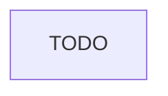

# Overview

Legend:
 * rounded = *start/end*
 * diamond = *descision*
 * flag = *note or manual action*
 * double-bar = *github action (subworkflow)*
 * rectangle = *a step*

## Regular Development
This figure shows the high-level interaction between different components.

## Distro Release

# Github Actions
Sub-workflows for each github action.

## Individual Repository
Github actions for individual plugins or repositories.

### `ci_pr.yml`
Test a pull request (in the usual way)

### `ci_main.yml`
Test (and build) a commit pushed to main

### `ci_trial.yml`
Test a PR in the context of an existing trial from package-integration

## Package Integration
Github workflows for creating distributions

### `distro_queue.yml`
Prevents too many GHA runners from being used by arbitrarily many distros

### `ci_distro_trial.yml`
Produce a new configuration for a distribution
